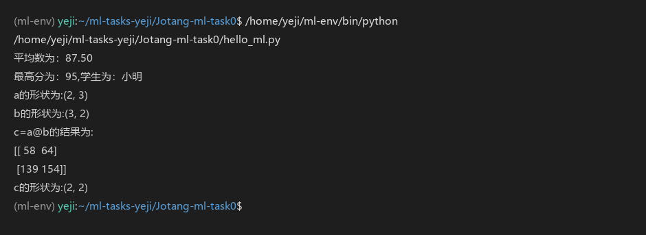

# 机器学习入门笔记

> 记录机器学习方向的入门学习过程，后面学到新内容会继续补充。

## 环境搭建三问

### 1. 为什么不同项目最好使用不同的 Python 虚拟环境？

虚拟环境是单独给项目准备的一个"房间"，和其他房间互不影响。如果不同项目共用同一个虚拟环境，就可能发生依赖冲突——环境为了适配另一个项目把某个包升级或降级，导致原项目崩掉，或者新项目在这个环境里装不上、跑不起来，最终项目运行失败。

### 2. CPU 和 GPU 各自擅长什么？训练神经网络为什么经常使用 GPU？

CPU 擅长逻辑处理、分支预测，单核能力强，像几个能力强的博士生；GPU 擅长并行计算，即同时执行大量简单运算，像很多个小学生一起做简单任务。神经网络中，各层神经元之间传递数据需要靠矩阵做大量乘加运算，使用 GPU 同时执行这些简单但数量庞大的运算，能让模型运行更快。

### 3. CUDA 是什么？它、显卡驱动与 PyTorch 之间大致是什么关系？

CUDA 是统一计算架构，可以实现单指令多数据运算，是能让代码在 NVIDIA 显卡上跑的工具库。层级关系来看（由上到下）：代码写到 PyTorch 上后，PyTorch 调用 CUDA，CUDA 再通过显卡驱动下发指令给 GPU，GPU 计算完成后返回数据：

```text
我写的代码
   ↓ 调用
PyTorch（深度学习库）
   ↓ 调用
CUDA（并行计算架构）
   ↓ 通过
显卡驱动
   ↓ 下发指令
GPU → 计算完成，数据原路返回
```

## 1. 人工智能、机器学习、深度学习的关系

- 人工智能（AI）：最大的概念，目标是让机器模拟人的智能，完成推理、识别、决策等任务。
- 机器学习（ML）：实现人工智能的一条路径。给机器任务和数据，再用合适的方法让它积累经验——经验多了，对目标任务就越来越熟练。关键是不靠人手写死板的规则，而是让机器从数据里自动学出规律。
- 深度学习（DL）：机器学习的一个分支，使用多层神经网络，自动提取复杂特征。

包含关系：AI ⊃ 机器学习 ⊃ 深度学习

## 2. 监督学习 vs 无监督学习

**监督学习**：数据有标签，给模型"输入 + 标准答案"（既有 x 也有 y），模型学习从输入到输出的映射，用来做预测。一般有线性回归和分类算法。

- 例子：猫狗图片分类（分类算法）；房价预测（输入房屋信息，标签是房价，线性回归）。

**无监督学习**：数据没有标签，只给原始数据（只有 x 没有 y），让机器自己挖掘数据内在的结构、分组。一般分为聚类算法、异常检测和压缩。

- 例子：用户聚类，把行为相似的用户自动分成几组；对一批都提到大熊猫的新闻做主题聚类。

## 3. 数据、特征、标签；训练集、验证集、测试集

- 数据：原始的全部材料，比如大量照片。
- 特征：描述样本的信息，如房屋的面积、楼层、朝向；图像的像素值。
- 标签：样本的"标准答案"，即分类或预测的目标，如猫/狗、房价。

数据集三分：

1. 训练集：喂给模型训练，更新参数，模型在这里学习规律；
2. 验证集：训练中途使用，用来调超参数（学习率、batch size 等），选出最好的模型；
3. 测试集：训练全程不碰，最后只用一次，评估模型真实的泛化能力。

## 4. batch size

batch size：一次送入模型训练的样本数量。

- batch 大：梯度更稳定；占用显存更大；训练迭代次数变少。过大容易收敛到局部最优点。
- batch 小：内存占用低；梯度噪声大，反而有机会跳出局部极小点；但迭代次数多，训练慢。

## 5. 模型、模型参数

- 模型：一套计算规则（神经网络就是一种模型），把特征输入进去，输出预测结果。
- 模型参数：模型内部可学习的权重和偏置。训练就是不断修改参数，让预测越来越准。例如线性回归里的 w 和 b。

## 6. 神经网络基础 & 激活函数

**基本组成**：输入层 → 隐藏层（神经元、权重、偏置）→ 输出层。

**激活函数**：每层线性计算完成后施加的非线性函数。

为什么需要激活函数：如果没有激活函数，无论叠多少层网络，整体仍然等价于单层线性运算，学不到复杂的非线性关系。

常见的几种：

1. Sigmoid：输出 0~1；容易梯度消失，深层网络少用。
2. Tanh：输出 −1~1；依旧存在梯度消失问题。
3. ReLU：f(x) = max(0, x)；最常用，计算简单、缓解梯度消失；缺点是可能出现神经元死亡。

## 7. 矩阵求导

矩阵求导：对标量损失函数，对矩阵形式的权重求偏导。∂f/∂y 分为分母布局和分子布局两种约定，我学习了机器学习中常用的几个分母布局特例：

1. ∂(Ay)/∂y = Aᵀ
2. ∂(yᵀAy)/∂y = (A + Aᵀ)y

另外学会了把线性回归方程转化为矩阵相乘的形式，以及对代价函数中矩阵求导。

## 8. 全连接层前向传播

设输入矩阵 X，权重矩阵 W，偏置 b：

```
Z = XW + b
A = σ(Z)
```

XW + b 就是全连接层的矩阵表达。前向传播就是逐层做"矩阵乘法 + 加偏置 + 激活"。

## 9. 前向传播、反向传播；损失函数、梯度、学习率

1. 前向传播：数据从输入层一层层算到输出层，得到模型的预测结果。
2. 反向传播：从输出端的损失出发，用链式求导往回逐层算出每个参数的梯度。

- 损失函数 Loss：衡量模型预测值与真实标签的差距，值越大代表预测越差，如 L = Σ(f(x) − y)²。
- 梯度：损失函数对参数的偏导数，告诉我们往哪个方向更新参数可以减小损失。
- 学习率 α：控制每一步参数更新的幅度。太大会过冲、可能永远到不了最小值（不收敛）；太小则每步挪一点点，训练极慢。

## 10. 优化器

优化器：根据梯度自动更新模型参数、使损失函数最小化的算法。

- SGD：随机梯度下降，基础版本。
- Momentum：带动量的 SGD，加速收敛，能冲出局部坑。
- Adam：自适应学习率，最广泛使用。

## 11. 欠拟合、过拟合、正则化

1. 欠拟合：模型能力太弱，偏差高。
   - 解决：增加网络复杂度、增加特征。
2. 过拟合：模型死记硬背了训练集的噪声，训练集上效果极好，到没见过的测试集上就很差，方差高。
   - 解决：收集更多数据、减少多项式使用、Dropout、正则化、早停。
3. 正则化：惩罚过大的权重，限制模型不要变得太复杂，抑制过拟合。
   - L1 正则：让部分权重变 0，实现特征稀疏；
   - L2 正则（权重衰减）：把权重整体往小拉，深度学习最常用。

## 附：hello_ml.py 运行记录

在终端（VS Code 集成终端，WSL Ubuntu）中执行：

```
/home/yeji/ml-env/bin/python /home/yeji/ml-tasks-yeji/Jotang-ml-task0/hello_ml.py
```

> 说明：用的是独立虚拟环境 ml-env 里的 Python 3.12，而不是系统 Python——因为所有依赖（numpy 等）都装在 ml-env 里。

输出：

```
平均数为：87.50
最高分为：95,学生为：小明
a的形状为:(2, 3)
b的形状为:(3, 2)
c=a@b的结果为:
[[ 58  64]
 [139 154]]
c的形状为:(2, 2)
```

运行截图：



结果核对：

- 平均分：95+90+80+85=350，350÷4=87.5，与输出一致；
- 最高分：4 组数据中最大的是 95（小明），正确；
- 矩阵乘法：(2,3) @ (3,2) → (2,2)，中间维度相消，形状符合规则；手动验算左上角元素 1×7+2×9+3×11=58，与输出一致。

## 学习片段：两个当时卡住的点

### 函数参数与外部变量名

```
def average_score(scores):        # 定义：参数名 scores 只在函数内有效
    return sum(scores.values()) / len(scores)

avg = average_score(students)     # 调用：把 students 传进去
```

调用时 `students` 的数据被递进函数，在函数内部它被叫作 `scores`——两个名字指同一份数据。这个机制我一开始看混了，后来用"快递单上写收件人"理解了。

### 矩阵乘法的形状规则

(m×n) @ (n×p) → (m×p)，中间的 n 必须相等且会"消失"。我运行的结果 (2,3)@(3,2)→(2,2) 印证了这条规则。
