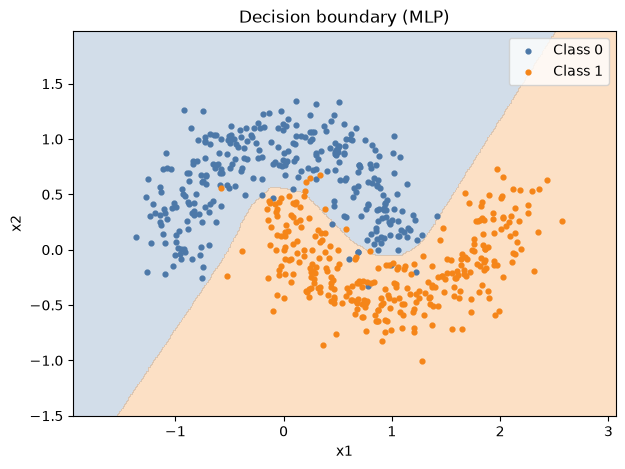
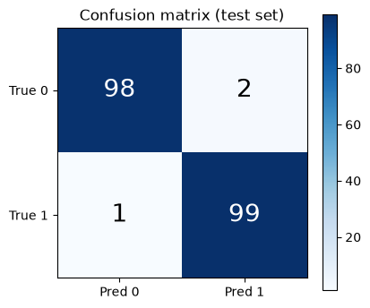

# Task1：简单神经网络（make_moons 二分类）

用 sklearn 的 make_moons 生成线性不可分的月牙形数据，训练一个多层感知机（MLP）完成二分类，并与纯线性模型做对照实验，验证非线性激活函数的必要性。

## 环境

- Python 3.12（ml-env 虚拟环境）
- torch 2.10.0+cu128、scikit-learn、matplotlib
- 运行方式：Jupyter Notebook 打开 task1_step1.ipynb 按 cell 顺序执行，或直接 `python task1.py` 运行合并版脚本

## 文件说明

| 文件 | 内容 |
|---|---|
| task1_step1.ipynb | 全部代码及运行输出：数据生成、模型、训练、评估、保存 |
| task1.py | 与 notebook 等价的完整代码（单文件版，无注释） |
| note.md | 学习笔记（实验记录 + 七问自答 + 踩坑实录） |
| data.png | make_moons 数据散点图 |
| curves.png | train/val loss 与 val accuracy 训练曲线 |
| decision-boundary.png | MLP 学到的决策边界 |
| linear-vs-mlp.png | 线性模型 vs MLP 对照实验 |
| confusion-matrix.png | 测试集混淆矩阵 |
| mlp_moons.pth | 训练好的模型权重（state_dict） |

## 实验设置

- 数据：make_moons，n=1000，noise=0.2，随机种子 42
- 划分：train/val/test = 600/200/200（stratify 分层）
- 训练：BCEWithLogitsLoss + Adam（lr=1e-3），full batch，1000 epochs

## 实验结果

| 模型 | 结构 | 最终 val acc | test acc |
|---|---|---|---|
| Linear（对照组） | Linear(2->1) | 0.8350 | - |
| MLP | 2->16->8->1，ReLU | 0.9400 | 0.9850 |

混淆矩阵（测试集）：[[98, 2], [1, 99]]，两类错误基本均衡。

## 结论

月牙形数据线性不可分，线性模型的决策边界是直线，val acc 被限制在 0.83 左右；MLP 依靠 ReLU 引入的非线性能力学出弯曲的决策边界，test acc 达到 0.985。模型权重保存在 mlp_moons.pth，可通过 state_dict 加载复现（加载后 test acc 与训练时一致）。
